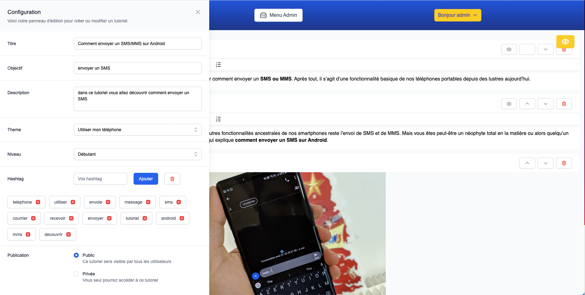

<br/>
<p align="center">
  <a href="https://github.com/Jesuisleon/WCS Ligne Bleue">
    
  </a>

  <h3 align="center">WCS Ligne Bleue</h3>

  <p align="center">
    "Ligne Bleue" is a training platform created by four students from Wild Code School. It helps digitally excluded individuals to master new technologies and stay connected with the world. Users can log in, complete tutorials and track their progress. This demo is not intended for release.
    <br/>
    <br/>
    <a href="https://wcs-ligne-bleue.vercel.app/">View Demo</a>
  </p>
</p>


## Table Of Contents

* [About the Project](#about-the-project)
* [Built With](#built-with)
* [Getting Started](#getting-started)
* [Installation](#installation)
* [Authors](#authors)

## About The Project



"Ligne Bleue" is a web-based training platform designed to address the needs of individuals who find themselves excluded from the digital world. Created by four students from Wild Code School, the platform aims to provide a welcoming environment where users can learn at their own pace and acquire the skills they need to navigate new technologies.

As an administrator, you will have access to a dedicated environment where you can create and edit tutorials. As a user, you will be able to log in, access tutorials, complete them and track your progress. This demo is not intended for release but offers a glimpse of what "Ligne Bleue" could become with further development and resources.

At its core, "Ligne Bleue" is about empowerment and inclusivity. It seeks to bridge the digital divide and ensure that no one is left behind in today's rapidly evolving world. Whether you are a complete beginner or looking to enhance your skills, "Ligne Bleue" offers a safe and supportive space where you can learn, grow and thrive.

## Built With

* [Vite](https://vitejs.dev/)
* [ESLint](https://eslint.org/)
* [Prettier](https://prettier.io/)
* [Nodemon](https://nodemon.io/)
* [React](https://fr.reactjs.org/)
* [Express](https://expressjs.com/fr/)
* [TinyMCE](https://www.tiny.cloud/)
* [Tailwind](https://tailwindcss.com/)
* [Headless UI](https://headlessui.com/)
* [Heroicons](https://heroicons.com/)

## Getting Started
Access Your Account as an Admin or User

As a platform administrator, you have access to powerful tools that allow you to create, edit, remove, and set tutorials to offline or online status. Simply login with your email address and password at our login page to access your dashboard. Once there, you can access the Admin Menu on the headbar to get started.

If you are a user looking to explore our platform, you can login with your email and password at the same login page. You will have access to a variety of themes and tutorials, allowing you to expand your knowledge and become more familiar with digital tools. In addition, you can leave comments and ratings on any tutorial to help other users and improve the overall experience.

We hope you find our platform helpful and easy to use. If you have any questions or concerns, please do not hesitate to contact us for support.

Admin email : adminlaposte@gmail.com
Admin password : adminadmin

User email : arthur@gmail.com
User password : toulouse

Enjoy

### Available Commands

- `setup` : Initialization of frontend and backend, as well as all toolings
- `migrate` : Run the database migration script
- `dev` : Starts both servers (frontend + backend) in one terminal
- `dev-front` : Starts the React frontend server
- `dev-back` : Starts the Express backend server
- `lint` : Runs validation tools, and refuses unclean code (will be executed on every _commit_)
- `fix` : Fixes linter errors (run it if `lint` growls on your code !)

To get a local copy up and running follow these simple example steps.

### Installation

2. Clone the repo

```sh
 Clone this repo, enter it
```

3. Install NPM packages

```sh
Run command `npm run setup`
```

3. Create a SQL database


4. Create your backend .env file with theses keys
```backend .env file
APP_PORT=
FRONTEND_URL=
DB_HOST=
DB_PORT=
DB_USER=
DB_PASSWORD=
DB_NAME=
JWT_SECRET=testtokenjwtWCS2022
```

5. Create your frontend .env file with this key
```frontend .env file
VITE_BACKEND_URL=
```

6. Run Migrate with this command
```sh
Run command `node migrate.js` on the backend folder
```
7. Create an account on <a href="https://www.tiny.cloud" TinyMCE 
and keep an API Key for free.

8. On the folder /frontend/src/pages/TutorialMaker/ you have to put your API Key on the TextMaker.jsx and the MediaMaker.jsx <Editor> config.

## Authors

* **Rémy Bernadin** - [Rémy](https://github.com/Remy-B-prog)
* **Lucas Fasilleau** - [Lucas](https://github.com/madashii)
* **Romain Timmer** - [Romain](https://github.com/RtimmerGH)
* **Léon Versavel** - [Léon](https://github.com/Jesuisleon)


